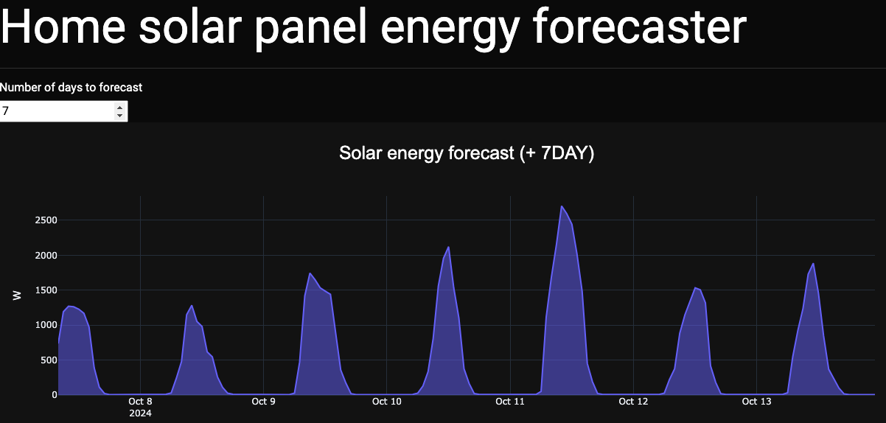

# Solar Panel energy forecasing

## Description:

This project aims to develop an end-to-end machine learning pipeline for training/predicting solar panel energy generation, enabling informed decisions regarding energy sales back to the grid. The pipeline retrieves live weather data via [open-metro](https://open-meteo.com/) API for realtime predictions. 

## Focus on Benefits:

Leveraging Octopus Energy's Agile half-hourly price match option, this project provides a valuable tool for homeowners with solar panels. By accurately forecasting solar energy production over the next 1-7 days, users can optimize their energy sales:

**Maximize Profit:** Sell excess power back to the grid during peak demand periods.
**Maintain Self-Sufficiency:** Ensure enough reserved energy for night-time use.

## Solar energy forecasting app
### Example of screen shot of app
Screen shot of the app showing the forecast of enery expected to be generated by the
solar panels.

### Evaluation of model using testing set
Plot shows how good the machine learning algorithm is at reconstructing 
energy generated by solar panel using only open-metro weather data

## Technical Details:

This is an end-to-end machine learning project where an XGBOOST leverages weather forcast data from the Open-Meteo API to predict solar panel energy generation. The code is strucured into maintainable, modular piplines that can be easily tested. 

Projects is developed using CICD, Docker and AWS. When a pull request is made to main the CICD pipeline is trigured:
 1) Continuious Intergration: Where unit tests are preformed 
 2) Coninuious Delivery: A docker image is made and pushed to AWS ECR
 3) Coninuious Deployment: Docker image is pulled from the ECR to the AWS EC2 instance and starts a new container from that image   

## Projects structure
### Configuration (config.yaml)
All the information the pipline needs to run is declared 
in config/config.yaml, controlling setting for:
    - Reading in solar panel data from using solis API
    - Reading in location specific weather data using Open-Meteo API
    - Where intermediate and model file are saved
    - Modeling settings (i.e. hyperparameters)

### app.py
Contains the code for the interactive dashboard that shows predicted future solar panel energy generation.

### Configuration manager
src/solarpanel_forecaster/configuration.py contains code for reading in and 
handling the information inside config.yaml and passing to pipeline components.

### Components
Contains the underlying code of the data pipelines. Fore example 
open_metroAPI.py contains the code to read in and process data
from the open-metro API.

### Entity 
Defines the arguments that the compent classes accept and should 
reflect the variable names inside config.yaml.

### Constants 
Where enviroment variables are read into python as global variables 

### Pipeline
Contains the modular pipelines for training and prediction

### train.py
Links the training pipelines into one stript that can be executed 
using python train.py

### predict.py
Links the prediction pipelines into one stript that can be executed 
using python predict.py
